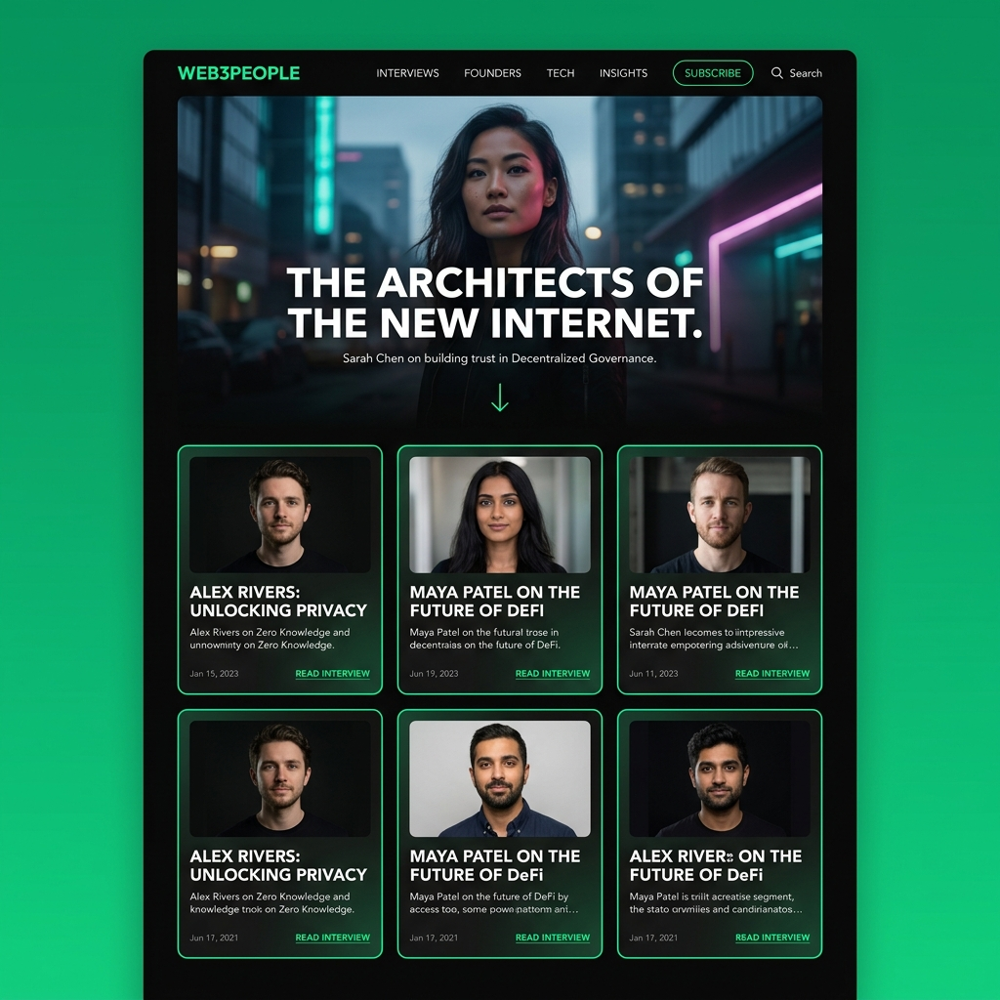
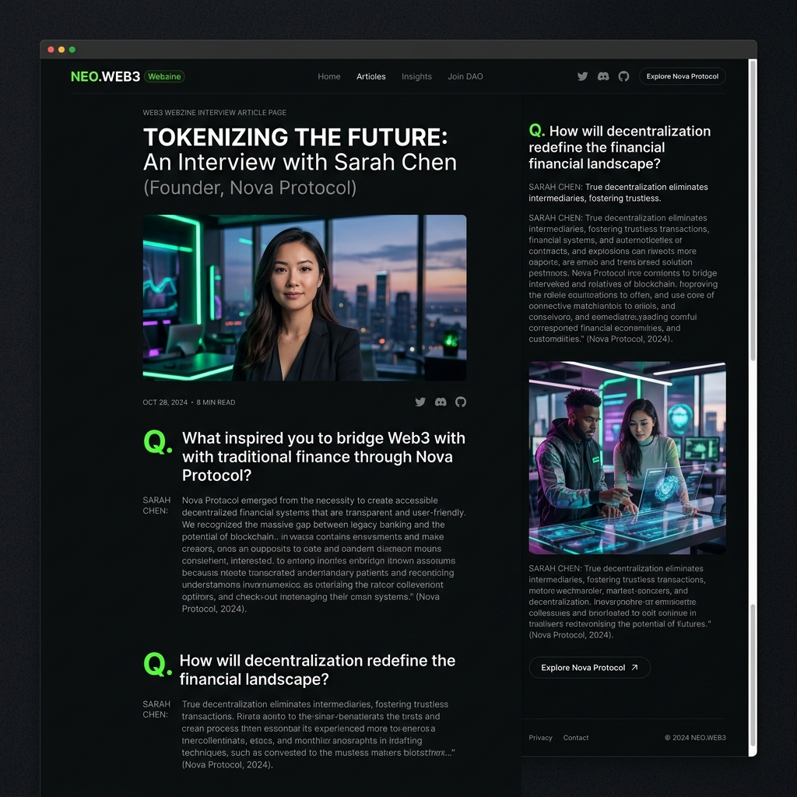

# UI Design Guide — web3people
> Created: 2026-03-29 00:00
> Last Updated: 2026-03-29 19:00

## 1. 디자인 포지셔닝

web3 특유의 네온/다크 감성과 프리미엄 매거진 에디토리얼 미학을 결합한다.
"크립토 뉴스 사이트"가 아닌 "사람을 다루는 고급 잡지"처럼 보여야 한다.

### 디자인 목업 (Preview)




**레퍼런스 DNA 종합:**
| 레퍼런스 | 차용 요소 |
|:---|:---|
| the-edit.co.kr | 인물/인터뷰 카드 레이아웃, 섹션별 색상 리듬, 고정 헤더 |
| eyesmag.com | Q&A 인터뷰 본문 포맷, 풍부한 여백, 이미지+텍스트 교차 |
| design.co.kr | 탐색 구조, 태그 시스템, 카드 그리드 |

---

## 2. 색상 시스템

### 기본 팔레트

```
--color-bg:        #0A0A0A    /* 거의 검정 배경 */
--color-surface:   #111111    /* 카드/섹션 배경 */
--color-border:    #1E1E1E    /* 구분선 */
--color-text:      #F0F0F0    /* 본문 텍스트 */
--color-text-muted:#888888    /* 보조 텍스트, 날짜, 직함 */
```

### 액센트 (web3 시그니처)

```
--color-accent:    #00FF9D    /* 민트/네온 그린 — 주요 CTA, 하이라이트 */
--color-accent-2:  #7B5CFF    /* 퍼플 — 보조 액센트 */
```

### 인터뷰 Q&A 전용

```
--color-question:  #F0F0F0    /* 질문: 밝은 흰색, font-weight 700 */
--color-answer:    #AAAAAA    /* 답변: 연한 회색 */
```

---

## 3. 타이포그래피

### 폰트 패밀리

```css
/* 주요 본문 + 헤드라인 */
font-family: 'Outfit', sans-serif;

/* 코드/기술 텍스트 (태그, slug 등) */
font-family: 'JetBrains Mono', monospace;
```

### 스케일

| 용도 | 크기 | 굵기 | 비고 |
|:---|:---|:---|:---|
| 히어로 제목 | 3.5rem (56px) | 700 | 인터뷰 타이틀 |
| 섹션 제목 | 2rem (32px) | 600 | |
| 카드 제목 | 1.25rem (20px) | 600 | 2줄 클램프 |
| 본문 | 1.125rem (18px) | 400 | line-height: 1.8 |
| 보조 텍스트 | 0.875rem (14px) | 400 | 날짜, 직함 |
| Q&A 질문 | 1.125rem (18px) | 700 | 인터뷰 본문 |
| Q&A 답변 | 1.125rem (18px) | 400 | color-answer |

```css
/* 한국어 텍스트 끊김 방지 */
word-break: keep-all;
```

---

## 4. 레이아웃

### 컨테이너

```css
max-width: 1440px;
padding: 0 24px;   /* 모바일 */
padding: 0 64px;   /* 데스크탑 */
```

### 그리드 (인터뷰 카드)

```
데스크탑: 3컬럼 그리드
태블릿:   2컬럼
모바일:   1컬럼
gap: 32px
```

---

## 5. 컴포넌트 가이드

**기본 뼈대(UI Library):**
모든 컴포넌트는 `shadcn/ui` 코드를 기반으로, 본 가이드의 색상(CSS Variables)과 매거진 특유의 네온/다크 타이포그래피를 적용하여 완전한 커스텀 형태로 리스타일링합니다.

### 5.1 인터뷰 카드

```
[ 이미지 (aspect-ratio: 3/4 세로형) ]
[ 태그 ]
[ 제목 (2줄 클램프) ]
[ 인물명 · 직함 ]
[ 발행일 ]
```
- 이미지 hover: scale(1.03), transition 0.3s
- 액센트 컬러 border 없음 (심플하게)

### 5.2 인물 카드

```
[ 프로필 사진 (원형 또는 정사각형) ]
[ 이름 ]
[ 직함 · 소속 ]
```

### 5.3 헤더

- 고정(sticky), 배경 blur + 반투명 (`backdrop-filter: blur(12px)`)
- 로고 (좌측) + 네비게이션 (우측)
- 네비: Interviews / People
- 모바일: 햄버거 메뉴

### 5.4 인터뷰 본문 (Q&A 블록)

```
Q. 질문 텍스트입니다.
   — font-weight: 700, color: #F0F0F0

   답변이 들어갑니다. 답변은 좀 더 연한 색상으로
   구분되어 읽기 편하게 표현합니다.
   — font-weight: 400, color: #AAAAAA
```
- Q 앞에 `Q.` 레이블을 민트 컬러로 강조
- 질문과 답변 사이 간격: 16px
- 각 Q&A 세트 사이 간격: 48px

### 5.5 히어로 섹션

- 풀폭 이미지 (viewport height: 70vh)
- 이미지 위 gradient overlay (하단 → 검정)
- 제목 + 인물명 + 발행일 오버레이

---

## 6. 모션

- 카드 hover: `transform: translateY(-4px)`, `box-shadow` 강화
- 페이지 전환: Next.js 기본 (추가 애니메이션 v2에서)
- 이미지 로딩: blur placeholder

---

## 7. 접근성

- 다크 배경 텍스트 대비: WCAG AA 최소 준수
- 이미지 alt 텍스트 필수 (어드민에서 입력)
- 키보드 네비게이션 가능

---

## Related Documents
- **Concept_Design**: [Lean Canvas](../01_Concept_Design/01_LEAN_CANVAS.md) - 브랜드 포지셔닝 참조
- **Concept_Design**: [Product Specs](../01_Concept_Design/02_PRODUCT_SPECS.md) - 페이지별 컴포넌트 구성
- **UI_Screens**: [홈페이지 리뷰](./02_HOME_REVIEW.md) - 실제 구현 화면 [TODO: 프론트엔드 개발 완료 후 작성]
- **Technical_Specs**: [DB Schema](../03_Technical_Specs/01_DB_SCHEMA.md) - 데이터 모델 참조
